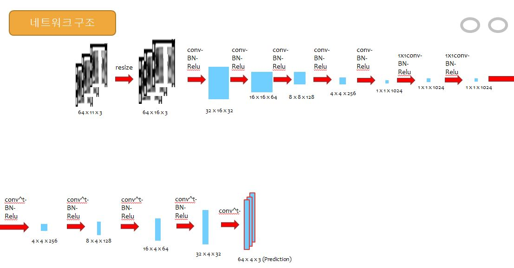

neural_motion_project

# 1.Dataset & Library
CMU Motion Capture Dataset - BVH Form
([https://sites.google.com/a/cgspeed.com/cgspeed/motion-capture/3dsmax-friendly-release-of-cmu-motion-database])

PyMO - BVH Parsing Library
([https://github.com/omimo/PyMO])

## 1.1.Detail
CMU Motion Capture Dataset의 모든 모션을 대상으로 실험을 진행한다.

모든 모션은 클립(Clip)화라는 전처리 단계를 거친 뒤, 이미지처럼 다루어진다. 클립에 대해선 2.1에서 자세히 설명한다.

전처리 단계를 거쳐 만들어진 클립은 총 61138개이며 이 중 약 90%인 54124개를 학습에 사용하고 나머지를 Validation에 사용한다.

이전 실험까지는 한쪽 발을 제외한 나머지 관절들로부터 한쪽 발의 위치만 추정하였지만 이번 실험부터는 양쪽 발, 다리를 제외한 나머지 관절들로부터 양쪽 발, 다리의 위치(총 4개)를 모두 추정한다.

# 2.Neural Net Architecture

## 2.1. Motion clip

Skeleton의 각 관절을 위와 같이 놓았을 때,

Frame, Joint, Axis를 축으로 삼아 순서대로 나열하여 마치 이미지처럼 보이게 한 것을 클립이라 한다.

본 실험에서 다루는 데이터의 경우 64개 Frame, 11개 Joint, 3개 Axis(x, y, z)이므로 각 클립은 세로 64, 가로 11, 채널 3개의 rgb 이미지처럼 보일 것이다.

## 2.2. Motion Auto Encoder
모션을 클립화하여 CNN의 Input으로 사용하는 방법을 제안한 논문([https://arxiv.org/abs/1703.03492])

모션을 Clip화한 Image에도 Pattern이 있고 이로부터 특징을 CNN으로 추출해 분류에 사용할 수 있다는 것이 위 논문의 핵심 아이디어이다.

다만 내가 풀고자 하는 문제는 원본 Skeleton의 일부 Joint 위치를 알 수 없는 상태에서 나머지 Joint의 위치만으로 해당 Joint의 위치를 추정해내는 것이므로, 이로부터 만들어지는 Clip Image는 위의 그림처럼 마치 한 줄이 지워져 나간 모습일 것이다.

Clip Image가 CNN으로 처리할 수 있는 분포와 패턴을 가지고 있다면, 영상으로부터 지워진 부분을 복원하는 Inpainting 문제를 푸는 방법과 유사하게 일부분이 지워진 Clip Image도 복원할 수 있을 것이라고 가정하고, 이렇게 복원된 Clip Image를 다시 모션으로 변환하여 지워진 Joint의 위치를 유추하는 것이 이 실험의 목표이다.

위 논문에서는 각 관절간의 상대거리로 클립을 나타냈는데, 내가 사용하는 데이터는 어차피 한정된 공간 안에서 움직이므로 그냥 절대위치(절대좌표)값을 사용하였다.

신경망 구조를 그림으로 나타내면 위와 같다. 4개의 열(관절)이 지워진 클립이 입력으로 주어지면, 

먼저 Convolution의 용이함을 위해 Resize된 뒤(Linear Interpolation),

5층의 (Strided Convolution + Batch Normalization + Relu) 계층,

2층의 (1x1 Convolution + Batch Normalization + Relu) 계층,

4층의 (Transposed Convolution + Batch Normalization + Relu) 계층을 거쳐 

마지막으로 1번의 Transposed Convolution 계층을 지나, 원본클립에서 지워진 열 각각에 대응되는 4개의 열을 가진 64x4x3 클립이 나오게 된다.

## 2.3. Augmentation
최초 실험시 절대좌표를 쓰다보니 회전변환에 약한 모습을 보여, 매 Epoch마다 모든 모션에 랜덤한 각도의 y축 회전변환을 적용하여 학습시켰더니 절대좌표를 사용함에도 불구하고, 회전에도 어느정도 강건해지게 되었다.

# 3.EXP Result

**Training clip : 54124**

**Test Frame : 7014**

**Input Joint : All Joints - {LeftKnee, LeftToe, RightKnee, RightToe}**

**Output Joint : {LeftKnee, LeftToe, RightKnee, RightToe}**

**Model : Motion Auto Encoder**

**Epoch : 10000**

**Optimizer : Adam Optimizer(LR : 0.0002)**

================================================================

최종 Training ED : 0.221

최종 Test ED : 3.031

Epoch당 실행시간 : 약 26초

# 4.Inference Visualization

[https://drive.google.com/file/d/13Il4k-H2cvRXv0rgfwfifXtl9RgiAC-z/view?usp=sharing]

# 5.Device

CPU : Intel i7 7820X

GPU : RTX 2080 x 2

OS : Windows 10 Pro 64bit

Main Memory : 16GB Dual Channel HyperX™ DDR4 XMP at 2933MHz (2X8GB)

Python version : 3.6.8

Anaconda version : 4.6.2

Tensorflow version : 1.12
