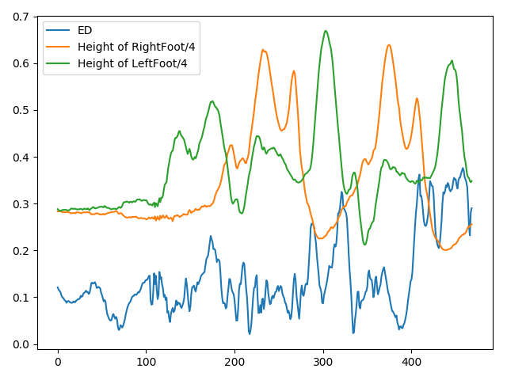
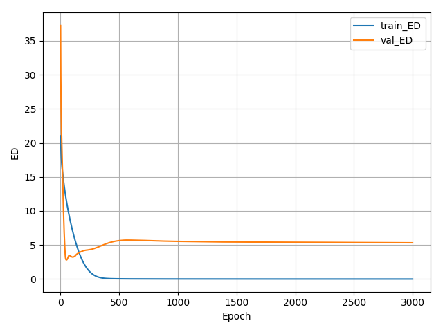
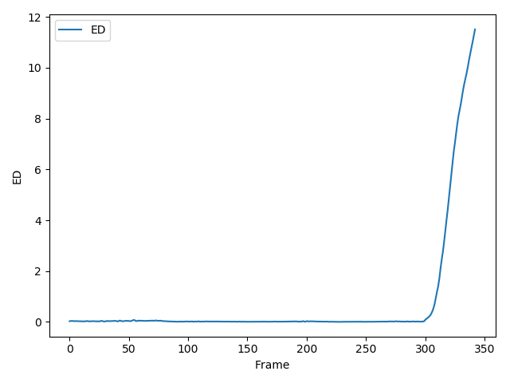
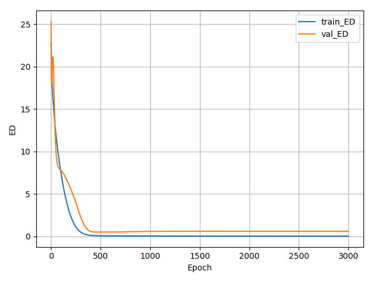
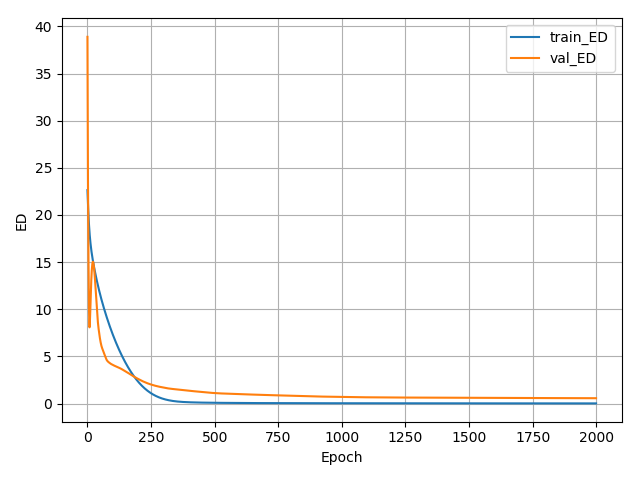
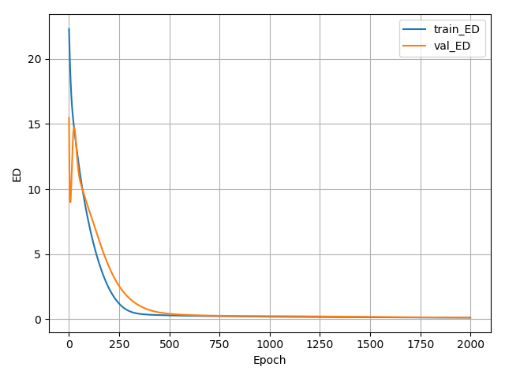
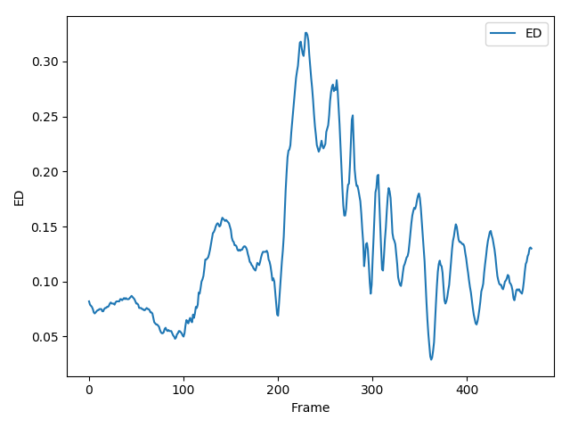
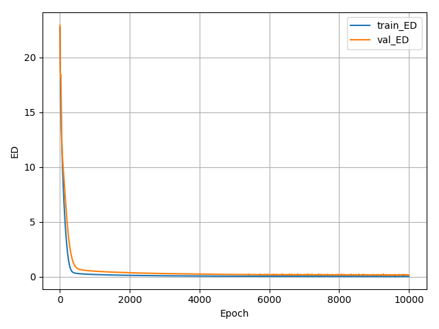
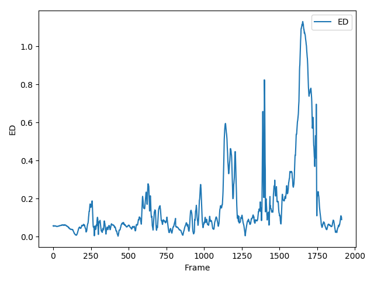

neural_motion_project

# 1.Dataset & Library
CMU Motion Capture Dataset - BVH Form
([https://sites.google.com/a/cgspeed.com/cgspeed/motion-capture/3dsmax-friendly-release-of-cmu-motion-database])

PyMO - BVH Parsing Library
([https://github.com/omimo/PyMO])


## 1.1.Detail
CMU Motion Capture Dataset중에서도 우선 Subject 16을 대상으로 실험을 진행한다.


Subject를 한정하는 이유는, 물론 본 과제의 최종적인 목적을 위해선 Subject Independant한 신경망이 필요할 것이나, 일단 Subject Dependant한 신경망을 학습시켜 대략적인 결과와 한계를 보고 싶기 때문이다.


또한 학습, 예측할 Motion의 종류를 우선 Locomotion으로 한정한다.(처음부터 모든 Distribution을 커버하려고 하기보다는 단순한 Motion에서 잘 작동하는지 확인하고 단계별로 확장해나가는 것이 좋아보이기 때문이다.)


Motion을 Locomotion으로 한정하는 것은 Subject 선정과도 관련이 있는데 Subject 69가 해당 조건에 부합하면서 Data의 Volume이 가장 컸다. 유사한 Subject로는 Subject 16이 있는데, Subject 69가 오직 걷기로만 구성된 반면 Subject 16은 점프와 뜀걸음(jog), 달리기(run)를 포함하고 있어 좀 더 Motion이 다양하다. 우선은 작은 Distribution이라도 커버하는 것을 보는 것이 목표이기 때문에 Subject 69를 사용한다.


69_01 ~ 69_67까지는 순수한 Locomotion이고 69_68 ~ 69_75는 물건을 집거나 앉았다 일어서는 등 좀 더 복잡한 동작이다.


학습엔 69_01 ~ 69_64까지 사용하고 Validation엔 69_65 ~ 69_67까지 사용한다. 69_68 ~ 69_75는 일단 사용하지 않는다.

### 1.1.1.Use All Data
EXP-5부터는 전체 Motion Data를 모두 사용한다. 서브젝트 상관없이 모든 모션의 수는 2548개이고 이 중 90%인 1 ~ 2293 모션을 Trainig Set으로 나머지 10%인 2294 ~ 2548 모션을 Test Set으로 사용한다. Training Set은 8배 Downsample(fps=15)해서 사용한다. 


1 ~ 2293 모션을 8배 Downsample했을 때 Training에 사용된 Frame수는 479984개이며, 2294 ~ 2548 모션을 그대로 사용했을 때 Test에 사용된 Frame수는 413825개이다.


# 2.Neural Net Architecture

## 2.1. 1-Layer Neural Net(Single Layer Perceptron)
모션을 처리하는데 적합한 구조에 대한 연구가 분명 있었을 것이고 논문도 나와있겠지만 논문을 찾아보기에 앞서 우선 단순한 1 Layer 신경망으로부터 실험을 해나가기로 한다. Input으로 들어가는 각 Joint의 Position들 간의 관계가 독립이지 않기 때문에 당연히 잘 안 되겠지만 Root(Hip) 하나만 찾는 문제의 경우 사실 Mean에 가까운 위치라서 얼추 나올 것 같기도 하다.


## 2.2. 4-Layer Neural Net
학습 데이터수 변화에 따른 변화를 관찰하기 위해 사용. EXP-6에서는 본 신경망에 Batch Normalization을 제거하고 Bias Function을 더해보았다.


# 3.Result Processing
Metric은 단순 Euclidean Distance와 Percentage of Correct Keypoint(PCK)를 사용한다.


학습에 사용한 Frame수에 따른 변화를 Table로 나타낸다.


Input Joint 수와 Output Joint 수를 변경시켜가며 Ablation Study를 진행한 결과를 Table로 나타낸다.(우선은 Root(Hip) 하나만 찾는 문제부터 시작하기로 한다.)


결과 모션을 시각화하는 코드를 작성한다.


# 4.Experiment Log
## 4.1.EXP-1
정말 단순한 문제부터 시작하기 위해 하나의 시퀀스(69_01) 안의 프레임들을 학습용과 Validation용으로 나눠 사용하였다.
Input Joint는 Root(Hip)를 제외한 Joint 전체, Output Joint는 Root(hip)이다. 즉 엉덩이를 제외한 나머지 관절위치만 보고 엉덩이의 위치를 예측하는 문제다.
신경망은 1-Layer Neural Net(Single Layer Perceptron)를 사용했고 GD로 학습시켰다.
10000 에폭 학습시켰다.


**Training Frame : 69_01 / 1~400 frame**


**Test Frame : 69_01 / 401~469 frame**


**Input Joint : All Joints - {Root(Hip)}**


**Output Joint : Root(Hip)**


**Model : 1-Layer Neural Net(Single Layer Perceptron)**


**Epoch : 10000**


**Optimizer : Adam Optimizer(LR : 0.0002)**


평균 0.301 정도까지 평균 Euclidean Distance가 줄어드는 것을 확인.


400까지가 학습에 사용한 프레임이며 이로부터 멀어질 수록 Euclidean Distance가 증가하는 것을 확인.


모션 데이터는 시계열에 따른 Corelation이 있고 마지막으로 학습한 프레임에서 멀어질 수록 본 적 없던 분포의 모션으로 변해가기 때문으로 추정.


증감을 반복하는 패턴으로 보건데, Locomotion의 반복되는 Phase들중 특정 Phase에만 신경망이 Optimize된 것이 아닌가하는 생각이 듬.


위 가설을 검증하기 위해 왼발과 오른발의 높이를 동시에 나타내 보았는데 적어도 이 신경망에서는 특별한 상관관계가 있다고 해석하기 어려워 보인다.





## 4.2.EXP-2
학습데이터수 변화에 따른 결과(ED)를 관찰한다.

통제 변인

**Test Frame : 69_02 / 301~343 frame**


**Input Joint : All Joints - {Root(Hip)}**


**Output Joint : Root(Hip)**


**Model : 4-Layer Neural Net**


**Epoch : 3000**


**Optimizer : Adam Optimizer(LR : 0.0002)**


조작 변인

**Training Frame**


### 4.2.1
**Training Frame : 69_02 / 1~300 frame (총 프레임 수 : 300)**



최종 Training ED : 0.004


최종 Test ED : 5.324


최저 Test ED : 2.815(그러나 이때 Training ED가 11.370로 측정되어 의미는 없음)



Trainig Set에 관해선 거의 모든 프레임에서 사실상 0에 가깝게 수렴. Test Set에선 Training Set의 시간으로부터 멀어질수록 오차가 증가.


### 4.2.2
**Training Frame : 69_02 / 1~300 frame + 69_01 (총 프레임 수 : 643)**




최종 Training ED : 0.009


최종 Test ED : 0.577


최저 Test ED : 0.490(Training ED : 0.043)


데이터셋이 약간 늘어난 것만으로 상당한 성능 상향을 확인

### 4.2.3
**Training Frame : 69_02 / 1~300 frame + 69_01 + 69_03 (총 프레임 수 : 1073)**




최종 Training ED : 0.016


최종 Test ED : 0.566


데이터셋이 늘어날수록 확실한 성능향상이 있음을 확인.


## 4.3.EXP-3

학습데이터 수 변화에 따른 결과(ED)를 관찰한다. 데이터 수를 대폭 확대하여 Subject 69의 모션 전체를 사용한다. 69_00 전체를 Test set으로 나머지 69_01 ~ 69_75 전체를 Trainig set으로 사용한다.


또한 프레임간 모션의 변화가 크지 않으므로 8배 Downsample해서 결과를 확인한다.


Epoch수는 2000으로 줄인다. 


**Training Frame : (69_02 ~ 69_75) /8**


**Test Frame : 69_01**


**Input Joint : All Joints - {Root(Hip)}**


**Output Joint : Root(Hip)**


**Model : 4-Layer Neural Net**


**Epoch : 2000**


**Optimizer : Adam Optimizer(LR : 0.0002)**




최종 Training ED : 0.120


최종 Test ED : 0.125





예상대로 데이터 수를 늘리자 8배 Downsample 되었음에도 Generalization 능력이 큰 폭으로 향상됨을 확인. 실수로 파일을 유실해서 기록하지 못했지만 16배 Downsample해도 최종 Test ED가 0.13 정도로 나오는 등 큰 성능저하는 없었음.


최종 Trainig ED를 보았을 때 Underfitting이 확실해 보이므로 다음실험에서 Epoch수를 5배 늘릴 것임. 

## 4.4.EXP-4

**Training Frame : 69_03 ~ 69_74 /8**


**Test Frame : 69_01, 69_02, 69_75**


**Input Joint : All Joints - {Root(Hip)}**


**Output Joint : Root(Hip)**


**Model : 4-Layer Neural Net**


**Epoch : 10000**


**Optimizer : Adam Optimizer(LR : 0.0002)**




최종 Training ED : 0.043


최종 Test ED : 0.163




69_01(1 ~ 469)와 69_02(470 ~ 813)에서는 0.4이하의 낮은 ED를 보여주었으나 앉기, 줍기 등의 복잡한 동작이 포함된 69_75(814 ~ 1912)에서는 심한 경우 ED가 1이 넘기도 하였음. 해당 신경망은 locomotion에 대해서만 잘 작동하는 것을 확인.


이것이 Data Imbalance 문제라면 Data를 바꿔봐야할 것이고 신경망 자체의 한계라면 신경망을 더 깊게 만들어야 함.


또한 지금까지 GD를 이용했는데 SGD를 이용해 보는 것도 좋을 것 같음.


## 4.5.EXP-5

여기서부터는 전체 Data set을 모두 활용하기로 한다. 자세한 사항은 1.1.1을 참고.


**Training Motion : 1 ~ 2293 /8**


**Test Motion : 2294 ~ 2548**


**Input Joint : All Joints - {Root(Hip)}**


**Output Joint : Root(Hip)**


**Model : 4-Layer Neural Net**


**Epoch : 30000**


**Optimizer : Adam Optimizer(LR : 0.002)**


최종 Training ED : 3.980


최종 Test ED : 5.606


Data set을 확대하자 매우 형편없는 결과를 보여주는데 Trainig set에서조차 일정 수준이상 수렴하지 않는 모습을 모여준다.


결과를 따로 기록하진 않았지만 신경망에 더 깊게 해보거나 Training set을 줄여보는 등 여러 시도를 해보았으나 결과가 나아지지 않았다.


## 4.6.EXP-6


**Training Motion : 1 ~ 2293 /8**


**Test Motion : 2294 ~ 2548**


**Input Joint : All Joints - {Root(Hip)}**


**Output Joint : Root(Hip)**


**Model : 4-Layer Neural Net(without BN)**


**Epoch : 30000**


**Optimizer : Adam Optimizer(LR : 0.002)**


Batch Normalization을 제거해보자 성능이 어느정도 향상되었다. 


전체 데이터(모집단)를 그대로 학습에 쓰기 때문에 Whitening에 사용되는 Moving Average와 Variance는 모집단의 것과 전혀 다르지 않을 것이고, 아마 이후 곱해지고 더해지는 scale factor(gamma)와 shift factor(beta)가, 일종의 신경망을 불필요하게 깊게 만드는 효과를 주고 있는 것은 아닌가 하는 생각에 본 실험을 계획해 보았다.


위 가정을 제대로 검증하기 위해 이후 본 실험에 사용한 'Batch Normalization을 제거한 4-Layer Neural Net'의 결과를 'Batch Normalization을 적용한 2-Layer Neural Net'의 결과와 비교하는 실험을 해보아야 겠다. 


또한 일반적으로 Batch Normalization은 거의 항상 Network의 수렴속도를 빠르게 하고 Regularizing 효과를 주어 신경망의 성능을 향상시키는 것으로 알려져 있는데 이런 경우는 처음 접해봐서 다소 의아하다. 이후 Batch Normalization 논문을 다시 읽어보고 좀 더 이론적인 검증을 해봐야겠다.


또한 ED의 진동이 일어나고 있는 것으로 보아 Learning Rate에 문제가 있는 것 같아 바로 Learning Rate를 1/10배해서 ED가 어디까지 줄어드는지 실험해 보아야겠다.


# 5.ETC

## 5.1.Pre-Numpylizing

실험에 사용할 Data가 커질수록 프로세스가 시작될 때 마다 BVH파일을 파싱해서 Position Batch로 만드는 작업에 시간이 너무 많이 소요되기 때문에 EXP-5부터는, 미리 전체 데이터를 통째로 배치로 만들어 놓고(input_batch.npy, label_batch.npy, test_input_batch.npy, test_label_batch.npy) 사용하였다.


위 과정을 수행하는데 30시간 이상이 소요되었다. 실로 BVH파일을 파싱해서 Position Batch로 만드는 작업엔 엄청난 시간이 소요되었던 것이다.


## 5.2.New Device

중간에 새로운 장비가 생겼다. 사양은 다음과 같다.


**CPU : 인텔 i7 7820X**


**GPU : RTX 2080 x 2**


**OS : Windows 10 Pro 64bit**


**Main Memory : 16GB Dual Channel HyperX™ DDR4 XMP at 2933MHz (2X8GB)**


**Python version : 3.6.8**


**Anaconda version : 4.6.2**


**Tensorflow version : 1.12**


### 5.2.1.CUDA & cuDNN for RTX2080

현재 Tensorflow에서 RTX라인 GPU를 사용하기 위해선, CUDA와 cuDNN을 직접 설치하는 방법보다는, Anaconda 가상환경안에 'conda install tensorflow-gpu' 명령어로 Tensorflow를 설치하며 Dependancy package로 딸려오는 것을 설치하는 방법이 버전충돌없이 가장 안정적이라고 한다고 한다.

### 5.2.2.Data Paraellism Code

2장의 GPU를 활용하기 위해선 코드를 병렬처리에 알맞게 수정해야 한다.


([http://openresearch.ai/t/tensorpack-multigpu/45])


위 링크를 참하여, 각 GPU에 Weight를 공유하는 동일한 모델을 복사하여 만들고, 각각의 Device에서 Feed Forward, Backward가 끝난 뒤 나온 Gradient의 평균을 구해 Weight를 Update하도록 하였다.


각각의 GPU 사용률이 60~70 수준에서 왔다갔다 하는데 추후에 아래 링크를 참조해 NCCL을 이용해 코드를 더욱 효율화해야겠다.


([http://openresearch.ai/t/nccl-efficient-tensorflow-multigpu-training/159])


## 5.3.Trouble-Shooting Stackoverflow

이 프로젝트가 시작된 뒤 나를 아주 오랫동안 극도로 스트레스 받게하고 괴롭히던 문제가 하나 있었는데, 일정 epoch이 돌고나서 'process finished with exit code -1073740791 (0xc0000409)'라는 에러코드를 뱉으며 아무 Traceback없이 Process가 죽어버리던 문제였다. 


에러코드 '0xc000040'는 Stackoverflow를 가리키고 보통 이런 문제는 Loop문 안에서 생기기 때문에 해당 Loop를 살펴보았으나 딱히 overflow를 유발할 만한 요소는 없어보였다. 결국 다른데서 원인을 찾기 시작하며 1주일이 넘는 시간동안 다음과 같은 온갖 삽질을 시도해 보았다.


**1. 엔비디아 드라이버 업그레이드 : 전혀 해결되지 않았음.**


**2. 엔비디아 컨트롤 패널에서 CUDA GPU사용 제외하고 렌더링옵션들 전부 끄거나 1로 놓기 : 전혀 해결되지 않았음.**


**3. pyqt 인스톨 : 전혀 해결되지 않았음.**


**4. 텐서플로우 재설치 : 전혀 해결되지 않았음.**


**5. 배치사이즈 줄임 : 돌 수 있는 에폭수만 2000 정도 늘어날 뿐 어느순간 같은 에러메세지 뱉으며 Process가 죽음.**


그러다 결국 Tensorflow Korea에서 어느 고마우신 분의 Code Review를 받고서야 문제를 알아차렸다. 내가 발견하지 못했을 뿐 사실 Loop문 안에 문제가 있었던 것이다.


```c
for epoch in range(max_epoch-already_done_epoch):
    ##Update
    _, ED = sess.run([train_op, tf.reduce_mean(loss_ED)], 
                          feed_dict={X: input_batch, Y: label_batch, is_training: True})
```


위 코드를 보면 for loop안의 sess.run 함수 안에 tf.reduce_mean 함수가 있는데 이 함수가 매 에폭을 돌때마다 텐서를 새로 생성해대서 stackoverflow가 발생하는 것이었다! 나는 내가 이런 실수를 할 수도 있다는 것에 정말 극도의 충격을 받고 말았다.


```c
mean_ED = tf.reduce_mean(loss_ED)

for epoch in range(max_epoch-already_done_epoch):
    ##Update
    _, ED = sess.run([train_op, tf.reduce_mean(mean_ED)], 
                          feed_dict={X: input_batch, Y: label_batch, is_training: True})
```


위와 같이 코드를 수정하여 문제를 해결하였다.


프레임 별로 ED를 각각 확인하는 코드와 평균 ED를 구하는 코드를 분리시키고 싶지 않아서 나름대로 효율적으로 한답시고 저렇게 짰던 건데 정말 극도로 나쁜 습관이라는 것을 깊게 실감하며, 앞으로는 절대 반복문안에 세션 이외의 tf계열 함수를(대부분의 tf계열 함수가 반환하는 것은 tensor다!) 삽입하지 않는 습관을 들여 다시는 저런 실수를 하지 말아야겠다.
