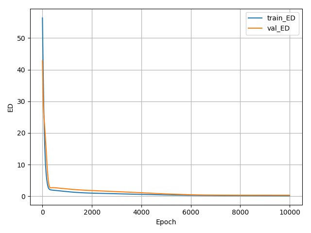
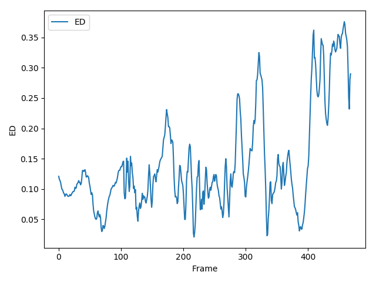

neural_motion_project

# 1.Dataset & Library
CMU Motion Capture Dataset - BVH Form
([https://sites.google.com/a/cgspeed.com/cgspeed/motion-capture/3dsmax-friendly-release-of-cmu-motion-database])

PyMO - BVH Parsing Library
([https://github.com/omimo/PyMO])

## 1.1.Detail
CMU Motion Capture Dataset중에서도 우선 Subject 16을 대상으로 실험을 진행한다.

Subject를 한정하는 이유는, 물론 본 과제의 최종적인 목적을 위해선 Subject Independant한 신경망이 필요할 것이나, 일단 Subject Dependant한 신경망을 학습시켜 대략적인 결과와 한계를 보고 싶기 때문이다.

또한 학습, 예측할 Motion의 종류를 우선 Locomotion으로 한정한다.(처음부터 모든 Distribution을 커버하려고 하기보다는 단순한 Motion에서 잘 작동하는지 확인하고 단계별로 확장해나가는 것이 좋아보이기 때문이다.)

Motion을 Locomotion으로 한정하는 것은 Subject 선정과도 관련이 있는데 Subject 69가 해당 조건에 부합하면서 Data의 Volume이 가장 컸다. 유사한 Subject로는 Subject 16이 있는데, Subject 69가 오직 걷기로만 구성된 반면 Subject 16은 점프와 뜀걸음(jog), 달리기(run)를 포함하고 있어 좀 더 Motion이 다양하다. 우선은 작은 Distribution이라도 커버하는 것을 보는 것이 목표이기 때문에 Subject 69를 사용한다.

69_01 ~ 69_67까지는 순수한 Locomotion이고 69_68 ~ 69_75는 물건을 집거나 앉았다 일어서는 등 좀 더 복잡한 동작이다.

학습엔 69_01 ~ 69_64까지 사용하고 Validation엔 69_65 ~ 69_67까지 사용한다. 69_68 ~ 69_75는 일단 사용하지 않는다.

# 2.Neural Net Architecture

## 2.1. 1-Layer Neural Net(Single Layer Perceptron)
모션을 처리하는데 적합한 구조에 대한 연구가 분명 있었을 것이고 논문도 나와있겠지만 논문을 찾아보기에 앞서 우선 단순한 1 Layer 신경망으로부터 실험을 해나가기로 한다. Input으로 들어가는 각 Joint의 Position들 간의 관계가 독립이지 않기 때문에 당연히 잘 안 되겠지만 Root(Hip) 하나만 찾는 문제의 경우 사실 Mean에 가까운 위치라서 얼추 나올 것 같기도 하다.

# 3.Result Processing
Metric은 단순 L2 Loss(Euclidean Distance^2)와 Percentage of Correct Keypoint(PCK)를 사용한다.

학습에 사용한 Frame수에 따른 변화를 Table로 나타낸다.

Input Joint 수와 Output Joint 수를 변경시켜가며 Ablation Study를 진행한 결과를 Table로 나타낸다.(우선은 Root(Hip) 하나만 찾는 문제부터 시작하기로 한다.)

결과 모션을 시각화하는 코드를 작성한다.

# 4.Experiment Log
## 4.1.EXP-1
정말 단순한 문제부터 시작하기 위해 하나의 시퀀스(69_01) 안의 프레임들을 학습용과 Validation용으로 나눠 사용하였다.
Input Joint는 Root(Hip)를 제외한 Joint 전체, Output Joint는 Root(hip)이다. 즉 엉덩이를 제외한 나머지 관절위치만 보고 엉덩이의 위치를 예측하는 문제다.
신경망은 1-Layer Neural Net(Single Layer Perceptron)를 사용했고 GD로 학습시켰다.
10000 에폭 학습시켰다.

**Input Frame : 69_01 / 1~400 frame**

**Output Frame : 69_01 / 401~469 frame**

**Input Joint : All Joints - {Root(Hip)}**

**Output Joint : Root(Hip)**

**Model : 1-Layer Neural Net(Single Layer Perceptron)**

**Epoch : 10000**

평균 0.17 정도까지 (L2 Loss * 3)^0.5가 줄어드는 것을 확인. (이게 Euclidean Distance의 평균은 아닌데 이 때 뭔가 착각해서 표를 잘못 만들어 버림. Plotting에만 쓰이는 값이라 나중에 결과 정리할 때 일괄적으로 수정해야 겠음)

400까지가 학습에 사용한 프레임이며 이로부터 멀어질 수록 Euclidean Distance가 증가하는 것을 확인.

모션 데이터는 시계열에 따른 Corelation이 있고 마지막으로 학습한 프레임에서 멀어질 수록 본 적 없던 분포의 모션으로 변해가기 때문으로 추정.

증감을 반복하는 패턴으로 보건데, Locomotion의 반복되는 Phase들중 특정 Phase에만 신경망이 Optimize된 것이 아닌가하는 생각이 듬.

중간에 비어보이는 부분은 그래픽 오류임 실제로는 부드럽게 이어져있다는 것을 inferencce_loss.txt를 보면 확인할 수 있음.
